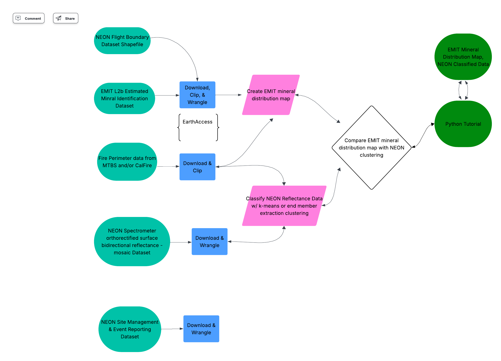

# AOP-EMIT
Exploratory analysis incorporating AOP and EMIT hyperspectral data

## Project Description:
This repository will be used for Randi Neff's & Hannah Rieder's capstone project to earn their Earth Data Analytics Professional Graduate Certificate from the University of Colorado Boulder. Bridget Hass from the National Ecological Observatory Network (NEON) will mentor this project.

#### This project will focus on two questions:
1. How can Python be used to compare mineral distribution maps from EMIT with classified surface reflectance data from NEON?
2. What are the differences in mineral distribution and surface reflectance between burned and unburned areas? How does fire alter surface minerals?

#### Background:
The Earth Surface Mineral Dust Source Investigation (EMIT) instrument is on the International Space Station (ISS). When the ISS is above predetermined arid dust source regions, EMIT uses imaging spectroscopy to measure mineral composition. To do this, EMIT measures the radiance at the sensor and surface reflectance. The surface reflectance is used to create mineralogical maps of the surface at every pixel. [NASA Earthdata, 2023](https://youtu.be/XzSEqdiS2aE?si=tVGhGFSt7dm2RFOG). EMIT data has a 60 meter resolution [Green, 2023](https://lpdaac.usgs.gov/products/emitl2bminv001/).

The National Ecological Observatory Network has 81 field sites covering 20 ecoclimatic domains in 48 U.S. states, Alaska, Hawaii, and Puerto Rico. Each field site has various sensors and tools to measure biological, physical, chemical, and ecological characteristics. NEON also has an Airborne Observation Platform (AOP), which is a set of instruments on a light aircraft that collect high resolution remote sensing data at a low altitude [NSF NEON](https://www.neonscience.org/about/faq). One of the datasets AOP collects is surface reflectance at 1 meter resolution [Spectrometer Orthorectified Surface Directional Reflectance](https://data.neonscience.org/data-products/DP3.30006.001).

#### How will we answer our questions?
We will focus on the NEON Soaproot Saddle Site (SOAP) in the Sierra National Forest in California. Specifically, we will focus on two wildfires that happened at the SOAP site in 2020 and 2021 - the Creek and Blue fires. Python will be used to download, wrangle, and clip EMIT mineral distribution maps to the SOAP flight box boundaries and the fire perimeters. Python will also be used to download, wrangle, and clip NEON surface reflectance data to the SOAP flight box boundaries and the fire perimeters. These NEON surface reflectance data will be classified using k-means or endmember extraction. Then, the EMIT mineral distribution maps will be compared to the classified NEON surface reflectance data using Python. The EMIT maps and classified NEON data will also be used to compare surface mineral distribution and reflectance between burned and unburned areas. Here is the proposed project workflow:

### Instructions to Run the Code:
The code for this project will be completed in Jupyter Notebooks in the Python language. To run the code, a way to open, use, and edit Jupyter Notebooks is required (such as Jupyter Notebooks itself or Visual Studio Code). Additionally, an environment and repository with specific packages and libraries will be ideal. To create said environment/repository, ensure mamba is installed and then use these commands:

* mamba create -n lpdaac_vitals -c conda-forge --yes python=3.10 fiona=1.8.22 gdal earthaccess h5py h5netcdf spectral scikit-image
* mamba activate lpdaac_vitals
* mamba install -c conda-forge --yes hvplot geoviews rioxarray rasterio geopandas jupyter jupyter_bokeh jupyterlab seaborn dask ray-default
