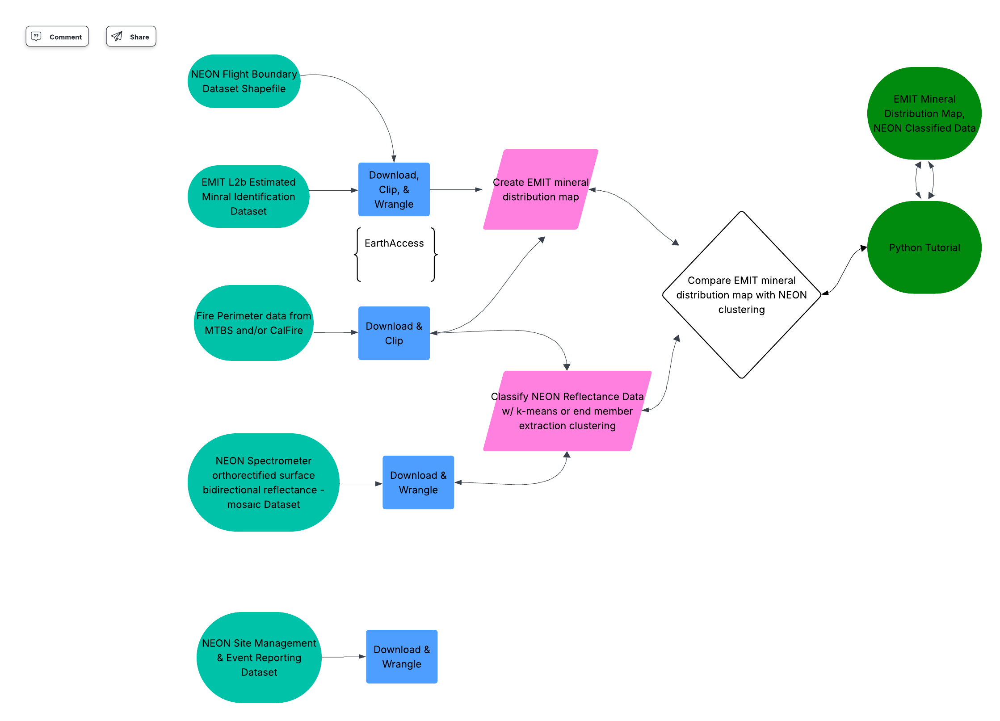

[](https://doi.org/10.5281/zenodo.15300127)

# Comparing Canopy Water Content using NEON and EMIT Hyperspectral Data

## Project Description:
This repository will be used for Randi Neff's & Hannah Rieder's capstone project to earn their Earth Data Analytics Professional Graduate Certificate from the University of Colorado Boulder. Bridget Hass from the National Ecological Observatory Network (NEON) will mentor this project.

#### This project will focus on two questions:
1. How can Python be used to compare mineral distribution maps from EMIT with classified surface reflectance data from NEON?
2. What are the differences in mineral distribution and surface reflectance between burned and unburned areas? How does fire alter surface minerals?

#### Background:
The NASA Earth Surface Mineral Dust Source Investigation (EMIT) instrument is located on the International Space Station (ISS). When the ISS is above predetermined arid dust source regions, EMIT uses imaging spectroscopy to measure mineral composition. To do this, EMIT measures the at-sensor radiance and surface reflectance. The surface reflectance is used to create mineralogical maps (See [NASA Earthdata, 2023](https://youtu.be/XzSEqdiS2aE?si=tVGhGFSt7dm2RFOG)). EMIT data has 60 meter resolution ([Green, 2023](https://lpdaac.usgs.gov/products/emitl2bminv001/)).

The NSF National Ecological Observatory Network ([NSF NEON](https://www.neonscience.org/about/faq)) consists of 81 field sites covering 20 ecoclimatic domains in 48 continental U.S. states, plus Alaska, Hawaii, and Puerto Rico. Each field site has various sensors and tools to measure biological, physical, chemical, and ecological characteristics. NEON also operates an Airborne Observation Platform (AOP), which is a set of instruments on a light aircraft that collect high resolution remote sensing data at a low altitude  (see [NEON Airborne Remote Sensing](https://www.neonscience.org/data-collection/airborne-remote-sensing) webpage). One of the datasets AOP collects is surface reflectance at 1 meter resolution (see [Spectrometer Orthorectified Surface Bidirectional Reflectance](https://data.neonscience.org/data-products/DP3.30006.002)).

#### How will we answer our questions?
We will focus on the NEON Soaproot Saddle Site ([SOAP](https://www.neonscience.org/field-sites/soap)) in the Sierra National Forest in California. Specifically, we will look at two wildfires that happened at the SOAP site in 2020 and 2021 - the [Creek](https://www.fire.ca.gov/incidents/2020/9/4/creek-fire) and [Blue](https://www.fire.ca.gov/incidents/2021/6/30/blue-fire/) fires. We will use Python to download, wrangle, and clip EMIT mineral distribution maps to the SOAP flight box boundaries and zoom in on a small area within the NEON flight box containing both burned and unburned pixels. Similarly, we will download, wrangle, and clip NEON surface reflectance data to the same small area encompassing both burned and un-burned areas. These NEON surface reflectance data will be classified using k-means or endmember extraction. Then, the EMIT mineral distribution maps will be compared to the classified NEON surface reflectance data. The EMIT maps and classified NEON data will also be used to compare surface mineral distribution and reflectance between burned and unburned areas. Here is the proposed project workflow:



### Datasets:
| Dataset Name                                                                                                                                            | Short Description                                                                                                                                                                                                                                                                         | Range, Resolution, and Area                                                                       | Data Citation                                                                                                                                                                                                                                                                                    |
|-------------------------------------------------------------------------------------------------------------------------------------------------------------|-------------------------------------------------------------------------------------------------------------------------------------------------------------------------------------------------------------------------------------------------------------------------------------------|---------------------------------------------------------------------------------------------------|---------------------------------------------------------------------------------------------------------------------------------------------------------------------------------------------------------------------------------------------------------------------------------------------|
| [EMIT L2A Estimated Surface Reflectance and Uncertainty and Masks (EMITL2ARFL)](https://lpdaac.usgs.gov/products/emitl2arflv001/)                                                             | Non-orthorectified surface reflectance derived by screening clouds and correction for atmospheric effects                                                                                                                                              | August 09, 2022 - ongoing, 60 m spatial resolution, each granule is abt 75 km by 75 km, areas are sunlit regions of interest between 52° N latitude and 52° S latitude            | Green, R. (2022). <i>EMIT L2A Estimated Surface Reflectance and Uncertainty and Masks 60 m V001</i> [Data set]. NASA EOSDIS Land Processes Distributed Active Archive Center. Accessed 2025-06-15 from https://doi.org/10.5067/EMIT/EMITL2ARFL.001                                          |
| [NEON - Site management and event reporting](https://data.neonscience.org/data-products/DP1.10111.001) | Records of land management activities, disturbances, and other notable ecological events for all NEON aquatic and terrestrial sites | July 2012 - ongoing; data has date, location, type, and numerical extent of event if possible | NEON (National Ecological Observatory Network). Site management and event reporting (DP1.10111.001), RELEASE-2025. https://doi.org/10.48443/af3c-5w64. Dataset accessed from https://data.neonscience.org/data-products/DP1.10111.001/RELEASE-2025 on May 2, 2025.                                                                                                                                                             |
| [NEON - Spectrometer orthorectified surface bidirectional reflectance - mosaic](https://data.neonscience.org/data-products/DP3.30006.002)    | Hyperspectral raster distributed in an open HDF5 format in UTM projection                                       | June 2013 - ongoing; 1 m spatial resolution; each file contains all 426 reflectance bands for a single 1 km by 1 km tile       | NEON (National Ecological Observatory Network). Spectrometer orthorectified surface directional reflectance - mosaic (DP3.30006.001), RELEASE-2025. https://doi.org/10.48443/49kq-8q12. Dataset accessed from https://data.neonscience.org/data-products/DP3.30006.001/RELEASE-2025 on April 28, 2025. |
| NEON - Flight Boundary Dataset Shapefile | NEON AOP flight boundaries in shapefile polygons | (0-1 unitless, scaled by 10,000) | See the “Flight Boundaries” section on this site: https://www.neonscience.org/data-samples/data/spatial-data-maps 
| Fire Perimeter Boundary from [CalFire](https://www.arcgis.com/home/item.html?id=692135b4e6ff47c8adae066ff477f4f1#overview) | Fire perimeters for fires greater than 50 acres in California between 2019 and 2023 | resolution unknown | California Fire Perimeters last 5 years View—Overview. (n.d.). Retrieved May 2, 2025, from https://www.arcgis.com/home/item.html?id=692135b4e6ff47c8adae066ff477f4f1#overview|

### Instructions to Set up the Python Environment:
The code for this project will be completed in Jupyter Notebooks in the Python programming language. To run the code, an Interactive Development Environment (IDE) is required to open, use, and edit Jupyter Notebook (.ipynb) files (we recommend Jupyter Notebooks, installed through [Anaconda](https://www.anaconda.com/) or alternatively [Visual Studio Code[(https://code.visualstudio.com/)). Additionally, an environment and repository with specific packages and libraries is needed. To create said Python environment (called `lpdaac_vitals` or another name of your choice), ensure mamba is installed and then use these commands:

```
mamba create -n lpdaac_vitals -c conda-forge --yes python=3.10 fiona=1.8.22 gdal earthaccess h5py h5netcdf spectral scikit-image
mamba activate lpdaac_vitals
mamba install -c conda-forge --yes hvplot geoviews rioxarray rasterio geopandas jupyter jupyter_bokeh jupyterlab seaborn dask ray-default
```

See https://github.com/nasa/VITALS/tree/main/setup for more information. 

Notes: `conda-forge` installations can take a long time to complete, so we recommend splitting up the installations into two sets, as shown above. The packages can all be installed at once but it may take a prohibitively long time. Either way, we recommend allowing the installations to run over night.

### Repository Structure:

```
project-root/
│
├── notebooks/                # Main folder for notebooks
│   ├── exploratory/          # Subfolder for exploratory analysis
│   │   ├── hr/               # Subfolder for Hannah Rieder's notebooks
│   │   │   ├── 01_hr_find_download_data.ipynb
│   │   │   └── 02_hr_visualize_data.ipynb
│   │   ├── rn/               # Subfolder for Randi Neff's notebooks
│   │   │   ├── 01_rn_find_download_data.ipynb
│   │   │   ├── 02_rn_explore_aop_data.ipynb
│   │   │   └── 03_rn_explore_emit_data.ipynb
│   │   ├── bh/               # Subfolder for Bridget Hass's notebooks
│   │   │   ├── 01_bh_find_download_data.ipynb
│   │
│   ├── final/                # Subfolder for finalized notebooks
│   │   ├── 01_find_and_download_collocated_data.ipynb
│   │   ├── 02_aop_endmember_extraction.ipynb
│
├── scripts/                  # Python scripts for processing and analysis
│   ├── preprocess.py
│   └── analysis.py
│
├── data/                     # Data folder (ignored by Git)
│   ├── raw/                  # Raw data (input files)
│   ├── processed/            # Processed data (intermediate files)
│   └── output/               # Final output files
│
├── results/                  # Results (e.g., plots, reports, etc.)
│   ├── figures/
│   └── summary.md
│
├── .gitignore                # Git ignore file
├── README.md                 # Project overview and instructions
└── requirements.txt          # Python dependencies
```

### Sources:

1. DP3.30006.001 | Spectrometer orthorectified surface directional reflectance—Mosaic | NSF NEON | Open Data to Understand our Ecosystems. (n.d.). Retrieved April 28, 2025, from https://www.neonscience.org/taxonomy/term/6146
2. Frequently Asked Questions (FAQ) | NSF NEON | Open Data to Understand our Ecosystems. (n.d.). Retrieved April 6, 2025, from https://www.neonscience.org/about/faq
3. Green, R. (2023). EMIT L2B Estimated Mineral Identification and Band Depth and Uncertainty 60 m V001 [Dataset]. NASA Land Processes Distributed Active Archive Center. https://doi.org/10.5067/EMIT/EMITL2BMIN.001
4. NASA Earthdata (Director). (2023, April 18). EMIT Data Tutorial Series Workshops Week 1: Intro to EMIT Mission and Data [Video recording]. https://www.youtube.com/watch?v=XzSEqdiS2aE
